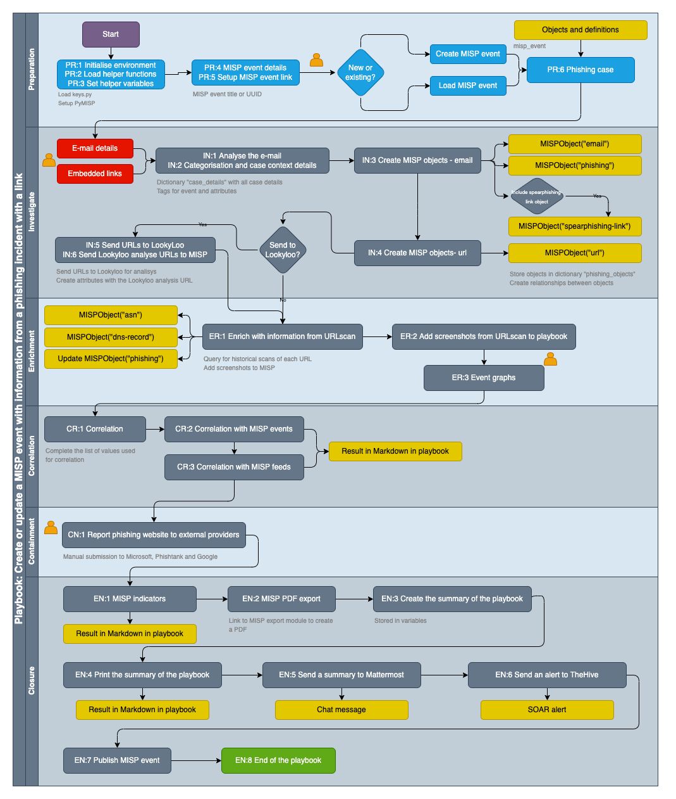

# MISP playbooks

MISP playbooks address common use-cases encountered by SOCs, CSIRTs or CTI teams to detect, react and analyse specific intelligence received by MISP.

The MISP playbooks are built with Jupyter notebooks and contain
- **Documentation** in **Markdown** format, including text and graphical elements;
- **Computer code** in the **Python** programming language, primarily with the use of PyMISP to interact with MISP and other sources for enrichment and notification.

## Documentation

This repository contains the documentation to get started with MISP playbooks.

- The [MISP playbook structure](documentation/MISP%20playbook%20structure.md) and [Jupyter notebook example](documentation/MISP%20playbook.ipynb) describe the structure of the MISP playbooks.
- The [MISP playbook guidelines](documentation/MISP%20playbook%20guidelines.md) help you with building and maintaining your playbooks.
- The [MISP playbook technical documentation](documentation/MISP%20playbook%20technical%20documentation.md) helps you with setting up your environment to run the playbooks.
- The [MISP playbook FAQ](documentation/MISP%20playbook%20FAQ.md) contains tips and tricks for using and developing playbooks.

## Playbooks

The repository contains these playbooks

**Create MISP objects and relationships**

- [MISP Playbook](misp-playbooks/pb_create_MISP_objects_and_relationship.ipynb) started from [issue 11](https://github.com/MISP/misp-playbooks/issues/11)
- - Use the [MISP Playbook with output](misp-playbooks/pb_create_MISP_objects_and_relationship-with_output.ipynb) to view the output of the notebook (with additional images)
- This playbook walks the analyst through the phases of creating MISP objects and adding a relationship between these objects. 
- - The playbook is typically *triggered* when an an analyst wants to add related, contextually linked, attributes to a MISP event.
- - The objects are added to a new or an existing MISP event. The playbook prints out a summary that can be used to notify colleagues via Mattermost or other channels.
- - The playbook uses an Emotet sample to demonstrate the functionality, with links from a file object to URL and HTTP request objects. It also creates the victim objects.
- Target audience: **SOC, CSIRT, CTI**

**Create or update a MISP event with information from a phishing incident with a link**
- [MISP Playbook](misp-playbooks/pb_create_or_update_a_MISP_event_with_information_from_a_phishing_incident_with_a_link.ipynb) started from [issue 1](https://github.com/MISP/misp-playbooks/issues/1)
- - Use the [MISP Playbook with output](misp-playbooks/pb_create_or_update_a_MISP_event_with_information_from_a_phishing_incident_with_a_link-with_output.ipynb) to view the output of the notebook (with additional images)
- This playbook creates a new MISP event or completes an existing MISP event with details of a **phishing incident**.
- - The playbook is *triggered* during the investigation of a phishing security incident. The playbook requires the phishing indicators such as the **links**, e-mail body, e-mail **headers**, e-mail **subject** and **senders** as *input*. It will then encode these values as attributes and objects in a MISP event. The playbook creates relationships between the objects and sets default tags (PAP, course-of-action matrix) and MISP clusters on event and attributes (*contextualisation*).
- - The playbook queries (local) MISP events and OSINT feeds for matches with the indicators. You can use this information for *correlation*. URLscan is queried for the links included in the e-mail. The historical scan results and screenshots are imported in the playbook and MISP. Next to the *enrichment* via the scan results, the query at URLscan also provides IP and ASN information of the location where the URL is hosted. The URLs are submitted to Lookyloo for further analysis. The phishing URLs are also reported (manually) to Google, Microsoft and Phishtank. 
- - A final report with a list of indicators is summarised in the playbook and sent via chat to Mattermost. The results can also be added as an alert to TheHive.
- Target audience: **SOC, CSIRT**

**Skeleton MISP playbook**
- [MISP Playbook](misp-playbooks/pb_skeleton.ipynb)
- This playbook can be used as a skeleton (or **template**) to start new MISP playbooks.
- Follow the [MISP playbook guidelines](documentation/MISP%20playbook%20guidelines.md) to create a new MISP playbook.
  
## Requesting new playbooks

If you identify a missing playbook then submit a [New MISP playbook proposal](https://github.com/MISP/misp-playbooks/issues) via the GitHub issue tracker.
