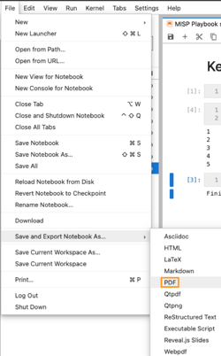

- [MISP playbooks - FAQ](#misp-playbooks---faq)
  - [I want to "comment out" a specific code cell](#i-want-to-comment-out-a-specific-code-cell)
  - [I want to get rid of the message "Would you like to receive official Jupyter news?"](#i-want-to-get-rid-of-the-message-would-you-like-to-receive-official-jupyter-news)
  - [Can I use Visual Studio Code to edit notebooks?](#can-i-use-visual-studio-code-to-edit-notebooks)
  - [How can I share the result of a playbook in other formats?](#how-can-i-share-the-result-of-a-playbook-in-other-formats)
  - [I have deleted a cell. Can get it back?](#i-have-deleted-a-cell-can-get-it-back)
  - [I'm not a big fan of the mouse. Can I use keyboard shorcuts?](#im-not-a-big-fan-of-the-mouse-can-i-use-keyboard-shorcuts)
  - [I want to run JupyterLab on a different network port](#i-want-to-run-jupyterlab-on-a-different-network-port)
  - [My system has multiple interfaces and I want to run JupyterLab on one interface, or I only want to run JupyterLab on the localhost interface](#my-system-has-multiple-interfaces-and-i-want-to-run-jupyterlab-on-one-interface-or-i-only-want-to-run-jupyterlab-on-the-localhost-interface)
  - [I want to change my password or I have forgotten my password.](#i-want-to-change-my-password-or-i-have-forgotten-my-password)
  - [I get the message "Could not determine jupyterlab build status without nodejs"](#i-get-the-message-could-not-determine-jupyterlab-build-status-without-nodejs)
  - [I want to add an additional Python library](#i-want-to-add-an-additional-python-library)


# MISP playbooks - FAQ

## I want to "comment out" a specific code cell

The easiest way is to convert the cell from code to raw.

## I want to get rid of the message "Would you like to receive official Jupyter news?"

When you first login to JupyterLab you get a message "Would you like to receive official Jupyter news?". This is caused by an "announcement extension". You can disable this message by activating the Python virtual environment and disable the extension.

```
source playbook/bin/activate
jupyter labextension disable "@jupyterlab/apputils-extension:announcements"
```

## Can I use Visual Studio Code to edit notebooks?

Yes you can. But unfortunate the setup with a self-signed certificate and a password protected JupyterLab does not play nice with Visual Studio Code (at least on OSX). If you **disable SSL** and **disable password access** you can add the notebook server as a remote kernel, edit the notebooks remotely and have them executed on your server. Please provide an update to this documentation if you have a more secure method of editing (remote) notebooks with Visual Studio Code.

## How can I share the result of a playbook in other formats?

You can export Jupyter notebooks in other formats, such as PDF, LaTeX or HTML. This export can also **include the output cells**, giving you an easy way to create a shareable report from your investigation.



Note that there are some additional packages that need to be installed, such as `jupyter-nbconvert` and `texlive-xetex`. Guidance can be found [here](https://nbconvert.readthedocs.io/en/latest/install.html).

## I have deleted a cell. Can get it back?

Yes.
To recover a deleted cell, right-click on the cell that became active after deletion, and select **Redo Cell Operation** or use the Shift + Z / CMD + Z keyboard shortcut.

## I'm not a big fan of the mouse. Can I use keyboard shorcuts?

Certainly!

The JupyterLab Notebook has two different keyboard input modes.
1. **Edit** mode allows you to type code or text into a cell.
   - Tab : code completion or indent
   - CTRL-M : enter command mode
2. **Command** mode binds the keyboard to notebook level commands
   - Enter : enter edit mode
   - Shift-Enter : run cell, select below
   - Ctrl-Enter : run selected cells
   - Alt-Enter : run cell and insert below
   - y : change cell to code
   - m : change cell to markdown
   - r : change cell to raw
   - L : toggle line numbers
   - d d : delete a cell

There is more at [Jupyterlab keyboard shortcuts](https://nocomplexity.com/documents/jupyterlab/keyboardshortcuts.html).


## I want to run JupyterLab on a different network port

Change `c.ServerApp.port` and restart the service.

## My system has multiple interfaces and I want to run JupyterLab on one interface, or I only want to run JupyterLab on the localhost interface

Change `c.ServerApp.ip` and set it to the desired IP, or to `127.0.0.1` for localhost only.

## I want to change my password or I have forgotten my password.

Run the `set_notebook_password.py` tool. This will add a new line with `ServerApp.password` to the configuration file. You can safely remove the previous `ServerApp.password` lines from the config file.

```
python tools/set_notebook_password.py playbook/config/misp-playbook-jupyter.py
```

## I get the message "Could not determine jupyterlab build status without nodejs"

This is only a warning, not an error message. No fix is necessary.

## I want to add an additional Python library

For JupyterLab you have to enable the Python virtual environment, install the library and then restart the JupyterLab service.

```
source playbook/bin/activate
pip install <mylibrary>

sudo systemctl restart misp-playbook-jupyter.service
```
