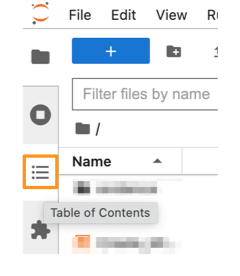
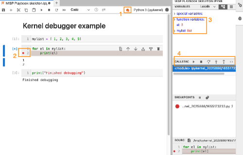
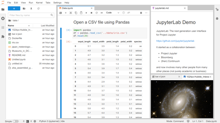
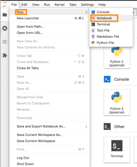
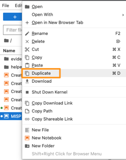
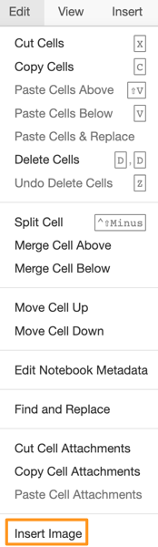
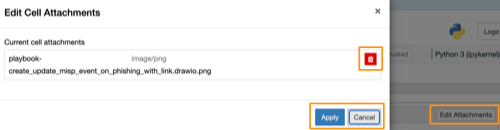

- [Introduction](#introduction)
  - [Jupyter Notebook](#jupyter-notebook)
  - [PyMISP](#pymisp)
  - [MISP playbooks](#misp-playbooks)
- [MISP playbook structure](#misp-playbook-structure)
- [MISP playbook guidelines](#misp-playbook-guidelines)
  - [Best practices](#best-practices)
    - [Title](#title)
    - [Notebook file name](#notebook-file-name)
    - [Dependencies](#dependencies)
    - [Cells](#cells)
    - [Execution steps](#execution-steps)
    - [Use separate cells for variables and code](#use-separate-cells-for-variables-and-code)
    - [Simple code cells](#simple-code-cells)
    - [Print (debug) output often](#print-debug-output-often)
    - [Coloured output](#coloured-output)
    - [Include new lines in your output](#include-new-lines-in-your-output)
    - [Table of content](#table-of-content)
    - [Store credentials outside the playbook](#store-credentials-outside-the-playbook)
    - [How to share a playbook with other users?](#how-to-share-a-playbook-with-other-users)
    - [Version tracking of playbooks](#version-tracking-of-playbooks)
    - [Always create a copy of a playbook](#always-create-a-copy-of-a-playbook)
    - [Avoid using extensions](#avoid-using-extensions)
  - [Playbook code development tips](#playbook-code-development-tips)
    - [Execute the playbooks in a Python virtual environment](#execute-the-playbooks-in-a-python-virtual-environment)
    - [Find a balance to modularising your code](#find-a-balance-to-modularising-your-code)
    - [Sequence of code execution](#sequence-of-code-execution)
    - [Restart the kernel and run all the cells again](#restart-the-kernel-and-run-all-the-cells-again)
    - [Code snippets](#code-snippets)
    - [Clean code principles](#clean-code-principles)
    - [Track changes between notebooks with nbdime](#track-changes-between-notebooks-with-nbdime)
    - [Use raw cells to disable code](#use-raw-cells-to-disable-code)
    - [Use a playbook skeleton](#use-a-playbook-skeleton)
    - [Debug a code cell](#debug-a-code-cell)
    - [Display line numbers in code cells](#display-line-numbers-in-code-cells)
- [Using JupyterLab](#using-jupyterlab)
  - [JupyterLab interface](#jupyterlab-interface)
  - [Starting a new playbook](#starting-a-new-playbook)
  - [Change cell type](#change-cell-type)
  - [Add, copy, paste, duplicate, move and delete cells](#add-copy-paste-duplicate-move-and-delete-cells)
  - [Run code and restart the kernel](#run-code-and-restart-the-kernel)
  - [Attachments](#attachments)
  - [Focus mode](#focus-mode)
- [Resources](#resources)

# Introduction

These guidelines document best practices on creating and using Jupyter notebooks. If you're in need of technical documentation on how to setup your environment then read [MISP Playbook technical documentation](MISP%20playbook%20technical%20documentation.md).

## Jupyter Notebook

A [Jupyter notebook](https://jupyter.org/) is an open-source interactive environment where users can write and **execute computer code**, observe the results of the code execution and combine the code with **text** (in Markdown) and **visualisations**. In essence it allows you to bundle code and documentation in one place. The computer code gets executed by what's called a *kernel* and for our playbooks we will be using **Python**. The editing of notebooks is mostly done via a web interface and notebooks are stored in a **JSON** format (for example [MISP playbook](MISP%20playbook.ipynb)). 

Jupyter notebooks comes in different flavours. Whereas **Jupyter Notebook** is the classic, traditional, notebook interface, **JupyterLab** is the latest web-based environment for notebooks. Contrary to the classic interface, the JupyterLab interface has a simple **file browser** that makes navigating between different notebooks easier and it also comes with a visual **debugger** that allows you to set breakpoints and inspect variables. In general notebooks can be run in the classic Jupyter Notebook interface as well as in the JupyterLab interface. The MISP playbooks are tested and developed in JupyterLab but should also work in the classic Notebook interface.

There's more information on Jupyter Notebook, JupyterLab and JupyterHub in the [MISP Playbook technical documentation](MISP%20playbook%20technical%20documentation.md)

## PyMISP

[PyMISP](https://github.com/MISP/PyMISP) is a Python library used to interact with the MISP REST API. It allows you to setup automation and integration with other tools but it also provides you an easy to use interface to manipulate MISP data and configuration settings.

## MISP playbooks

MISP playbooks address common use-cases encountered by SOCs, CSIRTs or CTI teams to detect, react and analyse intelligence received by MISP.

The MISP playbooks combine Jupyter notebooks and PyMISP to provide you
- **Documentation** and guidance in **Markdown** format, including text and graphical elements;
- **Python** and **PyMISP** code to interact with MISP or other information sources.

The MISP playbooks are stored and managed via a public GitHub repository [MISP/misp-playbooks](https://github.com/MISP/misp-playbooks). 

# MISP playbook structure

The MISP playbook structure is detailed in [MISP playbook structure](MISP%20playbook%20structure.md). Playbooks consist of

- An **introduction** with metadata
- The steps to **execute** ("playbook")
- A **closure** section.

# MISP playbook guidelines

## Best practices 

### Title

Always start a playbook with a self-explaining title and add the title as a top header (in Markdown with one `#`).

### Notebook file name

To make your life simpler it's advised to use notebook file names without spaces. Most modern operating systems have no problem with spaces in file names, but some of the supporting tools or scripts do not always take spaces into account. Instead of spaces you can use an underscore (_).

Also it is important to (re-)name a blank notebook immediately as JupyterLab will give an “Untitled.ipynb” name as default to all new notebooks.

The MISP playbooks in this repository all start with `pb_` and then the title of the playbook. Spaces in the title are replaced with an underscore.

### Dependencies

Document the dependencies required to execute the playbook. Add them to the technical details of the playbook and make sure users can easily install the dependencies, for example by creating a `requirements.txt` file. You can create such a file with `pip freeze` from within the Python virtual environment.

### Cells

When you add cells it's a good idea to have them only do one task at a time. This makes debugging easier and helps with maintaining the playbook.

### Execution steps

Use a unique identifier per execution step, for example "PR:1 stepname" or "EN:3 stepname". This makes it easier to refer to the steps in other sections and also makes the general overview much cleaner.

### Use separate cells for variables and code

If you expect your users to provide input by changing a variable then put these variables in separate cells. That way users who are less experienced with Python code do not get overwhelmed with code blocks and can easily spot the areas where they have to provide input.

### Simple code cells

Ensure that your code cells only do one thing at a time. It makes it easier for users of the playbook to follow the progress, and it makes development much more easier.

### Print (debug) output often

When users execute code in a cell in a playbook they expect some form of output. Seeing output is reassuring that the code was executed, even if the output indicates something is wrong. Make sure to print out the result of your code execution per cell.

### Coloured output

If you output results via Python (as code blocks) it's advised to use coloured output. Differentiating between good and bad results with a green or red colour makes it easier for users to spot errors. You can use colours by using for example `\033[91m` or `\033[92m` in your output.

### Include new lines in your output

Next to colours it's advised to include sufficient newlines (with `\n`) in your output. This makes it easier for your playbook users to read or interpret the results.

### Table of content

Include a table of content at the start of your playbook. 

In Jupyter Lab you can easily navigate in your notebook with the Table of Contents shortcut.



### Store credentials outside the playbook

Do not store credentials in the playbook. In our playbooks we load the `keys.py` file from a vault directory. Obviously as a user running the playbook you can still have a peak at the content of that file. But by storing the credentials outside the playbook you make it easier to share them with other users (or organisations), without having to bother with removing credentials.

### How to share a playbook with other users?

In general there are two reasons for sharing a playbook with other users,

- Either you want to provide some sort of **procedure** or workflow to users that they can use to execute a specific task. Or,
- You want to use the results of a playbook as a **report** (or as input for your own reports).

Whereas with the first option, using it as procedure, you do not want to include the output of the code execution, with the second option you definitely want to include that output.

Clearing the output is relatively easy in Jupyter Lab. Under the menu **Edit**, you can clear the output (**Clear Output**) of one cell, or you can clear the output of all cells (**Clear All Outputs**).

You can also clear the output of all cells by using a command `jupyter` command from within the Python virtual environment that is used to execute the playbooks.

```
jupyter nbconvert --ClearOutputPreprocessor.enabled=True --inplace playbook.ipynb
```

### Version tracking of playbooks

The playbooks are Jupyter notebooks. These notebooks are simple JSON files (see [The Jupyter Notebook Format](https://ipython.org/ipython-doc/3/notebook/nbformat.html)). This also means that you can easily store them in GitHub (or GitLab) and track changes between different versions (also see the development guideline on **nbdime** below).

It is advised that before you add a new playbook to GitHub, you clear the output of the cells. This avoids that you store potential confidential information in a code repository. Obviously if you want to keep track of playbooks for reporting purposes you do want to keep this output.

An easy way to make sure cell output is cleaned is by using a git hook, as explained by [Clearing Output Data in Jupyter Notebooks using Pre-commit Framework](https://zhauniarovich.com/post/2020/2020-06-clearing-jupyter-output/), or through other means such as [Clearing Output Data in Jupyter Notebooks using a Bash Script Hook](https://zhauniarovich.com/post/2020/2020-10-clearing-jupyter-output-p2/) and [Clearing Output Data in Jupyter Notebooks using Git Attributes](https://zhauniarovich.com/post/2020/2020-10-clearing-jupyter-output-p3/).

### Always create a copy of a playbook

When you start using a playbook it's good practice to make a copy of the playbook and then use that copy. This allows you to keep an un-changed **master** version of the playbook. You can for example append to the playbook name the case reference or date information (in YYYYMMDD format). 

### Avoid using extensions

Jupyter Notebook and JupyterLab have an ever growing list of extensions. And although they provide a lot of interesting features, it's advised to always take a step back before including them in your playbook. An extension can make the portability of your playbook more difficult as users will have to install / enable the extension as well.

## Playbook code development tips

### Execute the playbooks in a Python virtual environment

In almost all cases it is more beneficial to run your playbooks from a Python virtual environment. This allows you to control the installed versions and does not pollute your operating system installed libraries. Also see [MISP Playbook technical documentation](MISP%20playbook%20technical%20documentation.md).

### Find a balance to modularising your code

It will not be uncommon that you have to use the same code snippets in different playbooks. You can then modularise your code (store them in separate files) and **import** these modules in the initialisation phase of the playbook. The downside of this approach is that the playbooks become less portable, as you also have to include these modules when you share your playbooks.

For playbooks that are meant for use within your team or community it can make sense to modularise as much as possible and then distribute the modules (as separate files) together with the playbooks. If you plan to publish your playbooks to a larger audience, it makes sense to include all the necessary code in a single playbook. Note that you can collapse a cell in a notebook, which can already improve the readability.

If you do plan on modularising your code, it is advised to put these files in a separate directory. For example use this directory layout

```
notebooks/
  mynotebook.ipynb
notebooks/modules
  module1.py
  module2.py
vault/
  keys.py
```

### Sequence of code execution

In a traditional Python script you more or less control the execution sequence. In a notebook users can trigger codeblocks (cells) at will, regardless if this code depends on earlier code being executed. 

Introducing error handling to check that required previous code has executed is going to clutter your playbooks very quickly so it's advised not to do this. But be aware that the order of code execution in your playbook is controlled by the playbook user, not by your code logic.

### Restart the kernel and run all the cells again

Restarting the Python kernel very often (basically clearing the state of all variables) and rerunning all code cells in your playbook again is a very effective strategy to test the well-functioning of your playbook. 

### Code snippets

Although it's a good idea not to use extensions for portable playbooks, you can use extensions during development. One of the more useful extensions is [snippets](https://jupyter-contrib-nbextensions.readthedocs.io/en/latest/nbextensions/snippets/README.html). This extension adds a drop-down menu to the IPython toolbar that allows easy insertion of code snippet cells into the current notebook.

### Clean code principles

When you develop the Python code cells it's good practice to stick to the clean code principles, see [How to Write Beautiful Python Code With PEP 8](https://realpython.com/python-pep8/) and [PEP 8 – Style Guide for Python Code](https://peps.python.org/pep-0008/).

### Track changes between notebooks with nbdime

Primitive line-based diff and merge tools do not handle well the logical structure of notebook documents. With [nbdime](https://nbdime.readthedocs.io/en/latest/) you get **content-aware** diffing and merging of Jupyter notebooks. It is strongly suggested to install nbdime on your development environment and use it to track (code) changes between different versions of the playbooks.

### Use raw cells to disable code

If you want to test multiple versions of a Python code block then it's easiest to duplicate a cell and set the original cell to **Raw**. This prevents the Python kernel to interpret the statements in this cell. It's also much easier compared to commenting out large blocks of code in existing cells.

### Use a playbook skeleton

In order to avoid that you have to start from scratch for each new playbook it is advised to setup a skeleton playbook with all the necessary components, such as loading libraries and credentials. Then start the further development from this skeleton.

### Debug a code cell

JupyterLab has a built-in kernel debugger (1). This feature allows you to set a breakpoint (2) and inspect the code that is being executed in a cell. It also allows you to review the status of variables (3) and "walk" through the Python code step by step. This is a great way to spot errors in the Python code of your playbook.



### Display line numbers in code cells

It's useful to display the line numbers in code cells when you develop the playbook. Enable the line numbers via **View**, **Show Line Numbers**.

# Using JupyterLab 

## JupyterLab interface

*From [https://jupyterlab.readthedocs.io/en/stable/user/interface.html](https://jupyterlab.readthedocs.io/en/stable/user/interface.html)*

The JupyterLab interface consists of a main work area containing tabs of documents and activities, a collapsible left sidebar, and a menu bar. The left sidebar contains a file browser, the list of running kernels and terminals, the command palette, the notebook cell tools inspector, and the tabs list.



- **Menu bar**: The menu bar at the top of JupyterLab has top-level menus that expose actions available in JupyterLab with their keyboard shortcuts.
- **The left sidebar** contains a number of commonly-used tabs including:
- - a file browser,
- - a list of tabs in the main work and of running kernels and terminals,
- - the command palette (in 3.0+ moved to a modal window accessible with a keyboard shortcut),
- - the table of contents,
- - the extension manager.
- **The right sidebar** contains:
- - the property inspector (active in notebooks),
- - the debugger.

The column that allows to switch between tabs is called Activity Bar in JupyterLab.

The sidebars can be collapsed or expanded by selecting “Show Left Sidebar” or “Show Right Sidebar” in the View menu or by clicking on the active sidebar tab.

## Starting a new playbook

You can start a playbook from scratch by opening a **new notebook** or by **duplicating** an existing notebook, preferably a 'playbook skeleton'.

A new notebook can be started via **File**, **New Notebook**.



Duplicating an existing playbook (notebook) can be done by right clicking on the skeleton and then choosing **Duplicate**. Do not forget to immediately change the file name to something meaningful.



## Change cell type

You can change the cell type by first selecting the cell and then clicking the dropdown list at the top of the editor window. New cells are set by default to "code".

- **Code cells** : Contents in this cell is treated as statements in Python. When this cell is run, the result of the code execution is displayed in an output cell; 
- **Markdown cells** : These cells contain text formatted using Markdown;
- **Raw cells**: The content in raw cells is not evaluated by the notebook kernel. You can use this for code blocks that you do not want to get executed.


## Add, copy, paste, duplicate, move and delete cells

You can **Add**, **Copy**, **Paste**, **Duplicate**, **Move** and **Delete** cells by using the control buttons at the top of the editor window, or by clicking in a cell and then using the control buttons on the right of the cell.


## Run code and restart the kernel

You can **Run** ('play') and **Stop** code with the control buttons at the top of the editor window.

There is also a button to **Restart the Kernel** and a button to restart the kernel and **execute all cells** at once ('fast-forward').


## Attachments

You can add attachments (such as images) to notebooks via Edit, Insert Image. Note that you **cannot do this in JupyterLab**, you have to use **Jupyter Notebook** for this.



In the Jupyter notebook file they are stored in the cell with the key `attachments`. Attachments can increase the size of the notebook. If you want to remove the attachments then choose View, Cell Toolbar, Attachments.



## Focus mode

It can be useful to focus on only one notebook. With the JupyterLab **single document** mode you remove the visual indications of the other notebooks, without actually having to close them.

You can activate this mode via **View**, **Simple Interface**.

# Resources

- https://towardsdatascience.com/jupyter-notebook-best-practices-f430a6ba8c69
- https://levelup.gitconnected.com/jupyter-notebook-best-practices-fc326eb5cd22
- https://data36.com/how-to-use-jupyter-notebook-basics-for-beginners/
- https://ploomber.io/blog/clean-nbs/
- https://jupyter4edu.github.io/jupyter-edu-book/jupyter.html