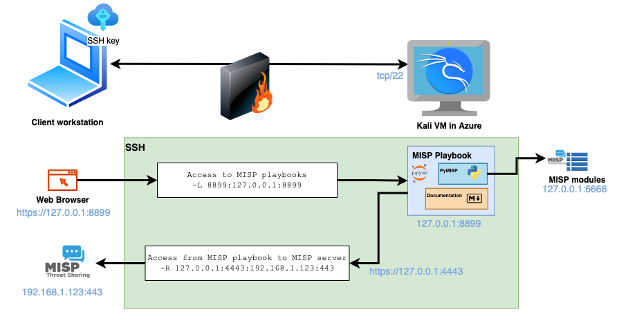
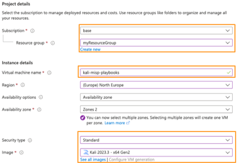
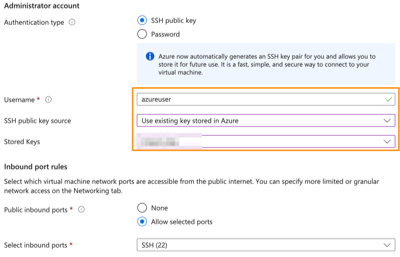
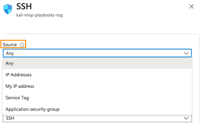
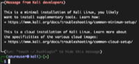
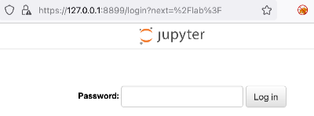
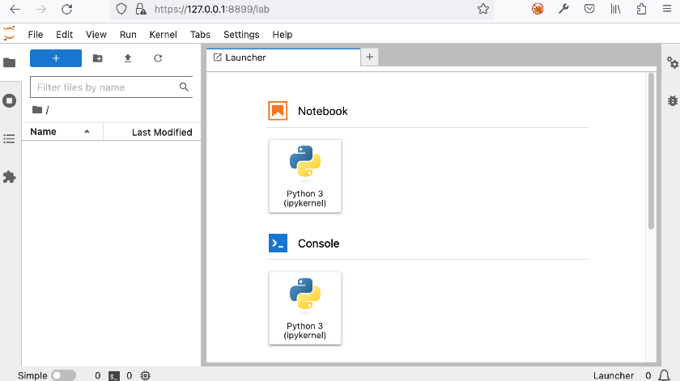
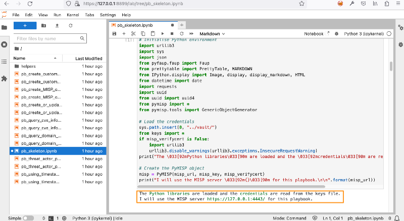

- [Introduction](#introduction)
- [Architecture](#architecture)
- [Installation](#installation)
  - [Setup Kali Linux](#setup-kali-linux)
  - [SSH with port forwarding and reverse shell](#ssh-with-port-forwarding-and-reverse-shell)
  - [Prepare the environment](#prepare-the-environment)
    - [Python virtual environment](#python-virtual-environment)
    - [MISP modules](#misp-modules)
  - [Setup playbooks](#setup-playbooks)
    - [Basic Jupyter configuration](#basic-jupyter-configuration)
    - [SSL](#ssl)
    - [Password protect notebooks](#password-protect-notebooks)
    - [Configuration check](#configuration-check)
  - [Systemd startup script](#systemd-startup-script)
  - [Browser access](#browser-access)
  - [Configuration for MISP](#configuration-for-misp)
    - [Authentication key](#authentication-key)
- [Standard MISP playbooks from the GitHub repository](#standard-misp-playbooks-from-the-github-repository)
  - [Copy the MISP playbooks](#copy-the-misp-playbooks)
  - [Install the libraries for MISP playbooks](#install-the-libraries-for-misp-playbooks)

# Introduction

In general MISP playbooks are installed on a MISP server but you can also use them on a separate system. This can be beneficial if you want to deploy the playbooks in an ad-hoc fashion, such as during an incident investigation.

This guide (with sections from the [technical documentation](MISP%20playbook%20technical%20documentation.md) and [MISP modules](https://github.com/MISP/misp-modules)) walks you through installing MISP playbooks on a Kali Linux VM in the Azure cloud.

# Architecture

The architecture

- Uses a **Kali Linux VM** in the Azure cloud;
- **MISP playbooks** are installed on the Linux VM;
- **MISP modules** are installed on the Linux VM;
- The access to Kali is via **SSH** (with key authentication);
- Playbooks are only accessible after logging in via SSH;
  - Via SSH port forwarding (`-L 8899:127.0.0.1:8899`)
- The playbooks can interact with MISP;
-   Via a reverse SSH tunnel (`-R 127.0.0.1:4443:192.168.1.123:443`).



This setup does require that the client machine (from which you start SSH and the browser) has access to MISP.

# Installation

## Setup Kali Linux

In Azure, navigate to **Virtual machines**, click **Create** and choose **Azure virtual machine**. 


Then choose your **Subscription** and the **Resource group**. If you plan to use the machine for incident investigations then create a new -specific for the investigation- resource group. Give the virtual machine a **name** and choose the **Kali 2023.3** image. Because of the Kali image you will need to set the Security Type to **Standard**. 



Under the Administrator account, keep the `azureuser` as username, choose SSH public key and create a new key pair or use an existing one. Allow inbound SSH traffic.



Then click **Review + Create** and confirm with **Create**. The deployment of the VM only takes a couple of seconds. When the deployment is finished, navigate to the VM resource and go to **Settings**, **Networking**, click on the line with "SSH" and change the inbound port rules. You can limit access to your IP or to an IP-range.



## SSH with port forwarding and reverse shell

After the deployment, the public IP of the machine is displayed under **Essentials** in the Overview tab. Then login to the virtual machine with the public ssh key and setup the port forwarding and reverse tunnel. In this case
- `-L 8899:127.0.0.1:8899` forwards the port 8899. In a later phase, JupyterLab will run on port 8899
- `-R 127.0.0.1:4443:192.168.1.123:443` creates a reverse tunnel from port 4443 (on the Kali host) to 192.168.1.123:443 (on the host starting the SSH connection). Replace 192.168.1.123 with the IP of your MISP server.

```
ssh -i keychain/mispcis_key.pem -L 8899:127.0.0.1:8899 -R 127.0.0.1:4443:192.168.1.123:443 azureuser@1.2.3.4
```

If all went well, you get the Kali Linux prompt.



## Prepare the environment

Clone the MISP playbook repository from GitHub.

```
git clone https://github.com/MISP/misp-playbooks
cd misp-playbooks
```

### Python virtual environment 

All the playbooks are executed from a **Python virtual environment**. This allows you to have multiple versions of Python libraries installed, independent of those already provided by your Linux system or other installed projects. In this case we create the virtual environment (called `playbooks`) and activate this environment. 

First update apt, then install virtualenv, create the virtual environment and install the necessary Python libraries.

```
sudo apt-get update
sudo apt install python3-virtualenv
virtualenv -p /usr/bin/python3 playbooks
source playbooks/bin/activate
pip install pymisp jupyterlab notebook
```

### MISP modules

When playbooks are installed on a MISP server they can -in most cases- directly interact with the [MISP modules](https://github.com/MISP/misp-modules). In this setup, on a separate VM, we have to manually install the modules. The MISP modules are used to do enrichments and create MISP attributes and objects.  Install the Linux packages, clone the MISP modules repository and install the Python libraries for the modules in the same Python virtual environment used for the playbooks.

```
sudo apt-get install python3-dev python3-pip libpq5 libjpeg-dev \
      tesseract-ocr libpoppler-cpp-dev imagemagick virtualenv \
      libopencv-dev zbar-tools libzbar0 libzbar-dev \
      libfuzzy-dev build-essential -y

git clone https://github.com/MISP/misp-modules.git
cd misp-modules

pip install -I -r REQUIREMENTS
pip install .
```

Test if the MISP modules start correctly.

```
misp-modules -l 127.0.0.1 -d
```

This should result in output similar to the one below.

```
...
2023-10-23 11:43:34,566 - misp-modules - INFO - MISP modules vmray_import imported
2023-10-23 11:43:34,567 - misp-modules - INFO - MISP modules csvimport imported
2023-10-23 11:43:34,568 - misp-modules - INFO - MISP modules server started on 127.0.0.1 port 6666
```

If the modules start correctly you can use the **systemd** script (an adjusted version from the MISP modules repository) to start the modules.

```
sudo cp ../config/azureuser-misp-modules.service /etc/systemd/system/misp-modules.service
sudo systemctl daemon-reload
sudo systemctl enable --now misp-modules
sudo service misp-modules start
```

## Setup playbooks

### Basic Jupyter configuration

The MISP playbook repository contains a basic Jupyter configuration file that you can use as a start to configure your environment. Move up one directory (assuming you were still in `misp-modules`). Create a configuration directory, copy the configuration file and create a directory for your notebooks.

```
cd ..
mkdir playbooks/config
cp config/azureuser-misp-playbook-jupyter.py playbooks/config/misp-playbook-jupyter.py
mkdir playbooks/my-playbooks
```

### SSL

It is a good idea to use SSL to encrypt the communication between your client (web browser) and JupyterLab. Create a self-signed certificate or use a valid certificate from services such as [Let’s Encrypt](https://letsencrypt.org/). Strictly speaking the communication is already encrypted by tunneling the traffic over SSH. But using SSL now avoids unencrypted traffic if you ever decide to access JupyterLab directly.

```
openssl req -x509 -nodes -days 3650 -newkey rsa:2048 -keyout playbooks/config/playbook-ssl.key -out playbooks/config/playbook-ssl.pem
```

### Password protect notebooks

Protect the access to your notebooks with a password. The MISP playbook repository contains a helper script that asks for a password and stores the hash in a configuration file with the variable `ServerApp.password`. Start the script [tools/set_notebook_password.py](../tools/set_notebook_password.py) from the Python virtual environment and provide it the earlier created configuration file.

```
python tools/set_notebook_password.py playbooks/config/misp-playbook-jupyter.py
```

### Configuration check

Review the configuration file `playbooks/config/misp-playbook-jupyter.py` . Pay attention to the path used for **root_dir** and make sure `c.ServerApp.ip` is set to 127.0.0.1. 

## Systemd startup script

Copy the sample **systemd** (specific for the Kali Linux VM in Azure) script. Review the configuration of the systemd script, especially the values for **User** and **Group** and the paths in **ExecStart**. If everything looks good you can enable and start the daemon.

```
sudo cp config/azureuser-misp-playbook-jupyter.service /etc/systemd/system/misp-playbook-jupyter.service

sudo systemctl daemon-reload
sudo systemctl enable misp-playbook-jupyter.service
sudo systemctl start misp-playbook-jupyter.service
```

Verify that the service started without problems.

```
journalctl -u misp-playbook-jupyter
```

You should then get a message similar to the one below.

```
... ServerApp] jupyterlab | extension was successfully loaded.
... ServerApp] nbclassic | extension was successfully loaded.
```

## Browser access

Now open your browser and navigate to `https://127.0.0.1:8899`. If all went well you get a web page asking you to enter the password you provided earlier. 



When you enter the password you should be greeted with the JupyterLab web interface.



## Configuration for MISP 

### Authentication key

The playbooks require a MISP API key and they will typically load the credential information from a `keys.py` file stored in the `vault` directory. First create the vault directory in your Python virtual environment (most likely `playbooks`) and add a keys.py file.

```
mkdir playbooks/vault
touch playbooks/vault/keys.py
```

A basic `keys.py` must have at least the below entries.
```
misp_url="https://127.0.0.1:4443/"
misp_key="APIKEY"
misp_verifycert=False
```

You can create a new MISP API key via the MISP web interface by navigating to **Global Actions**, **My Profile** and then choosing **Authentication key**. Provide a meaningful comment when you create the new API key. Then 

- Add this key to keys.py (in `misp_key`)
- Update the MISP URL (in `misp_url`). Because we use a reverse tunnel to get access to our MISP server, use `https://127.0.0.1:4443` (or the port you specify for the tunnel)

# Standard MISP playbooks from the GitHub repository

## Copy the MISP playbooks

The standard MISP playbooks are in the folder `misp-playbooks`. Copy these playbooks into your working directory.

```
cp -rp misp-playbooks/* playbooks/my-playbooks/
```

## Install the libraries for MISP playbooks

Some MISP playbooks require additional Python libraries. You can install them with pip.

```
pip install -r documentation/requirements.txt
```

# Test the environment

The easiest way to test that your environment is setup correctly is by using a copy of the `pb_skeleton.ipynb` playbook. If you're able to start the playbook then you know that the JupyterLab environment is setup correctly. After that, run the playbook to check if your connection to MISP is functional and if you can access the local version of the MISP modules.


