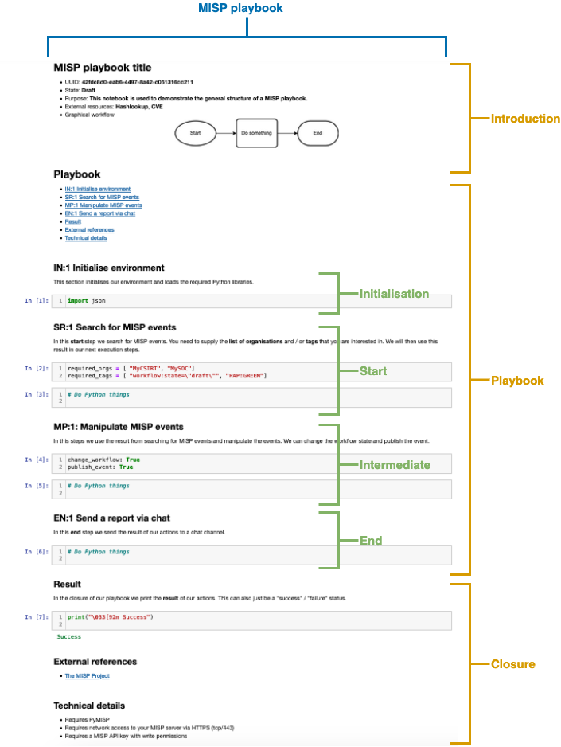

# MISP playbooks - structure

## Introduction

MISP playbooks address common use-cases encountered by SOCs to detect, react and analyse specific intelligence received by MISP.

MISP playbooks are built with Jupyter notebooks and contain
- **Documentation** in **Markdown** format, including text and graphical elements;
- **Computer code** in the **Python** programming language.

The computer code uses PyMISP to interact with MISP but can also rely on the Python requests library. The interaction with other tools and services is via their API and with the help of Python libraries such as the Timesketch, Shodan or VirusTotal Python clients. When no specific Python library is available the 'requests' library is used to interact with the API.

## Conventions and Terminology

The key words "MUST", "MUST NOT", "REQUIRED", "SHALL", "SHALL NOT", "SHOULD", "SHOULD NOT", "RECOMMENDED", "MAY", and "OPTIONAL" in this document are to be interpreted as described in RFC 2119 [RFC2119](https://www.rfc-editor.org/rfc/rfc2119).

# Format

MISP playbooks inherit the format of Jupyter notebooks. Jupyter notebooks are simple JSON documents, containing text, source code, rich media output, and metadata. Each segment of the document is stored in a cell.

# Structure

## Introduction

Each MISP playbook must contain three sections

- Introduction 
- The steps to execute ("playbook")
- Closure  

Each section is added as one or more **Jupyter notebook cells**.

## Introduction 

The introduction must be present. It exists as one or more Jupyter notebook cells in **Markdown** format. In a later stage this can be transformed to a more structure (JSON) format or added to the Jupyter notebook metadata section.

- *required* **Title**
- *required* **UUID**
- *optional* **Version**
- *required* **State**
- *optional* **Last update** 
- *optional* **External resources** 
- *optional* **Tags** 
- *required* **Purpose**
- *optional* **Target audience**
- *optional* **Graphical workflow**

### State

The playbook state is one of these two states

- **draft** indicates this is a rough outline of a playbook
- **production** indicates the playbook has undergone reviews and is considered complete

### External resources

The external resources are listed as a text block and contain the references to the external resources (such as 'VirusTotal', 'Shodan') required by the playbook.

### Tags

Tags are used to classifiy the notebook and are provided as a list. They may use the format of MISP tags and [taxonomies](https://github.com/MISP/misp-rfc/blob/main/misp-taxonomy-format/raw.md.txt).

### Purpose

The purpose of the playbook is described in textual format.

### Target audience

The intended users or target audience of the playbook is described in textual format.

### Graphical workflow

The graphical workflow provides a high level overview of the steps of the playbook. TThis workflow can19 rely on [Mermaid](https://mermaid-js.github.io/mermaid/#/), the [Dot](https://github.com/laixintao/jupyter-dot-kernel) language or be an export of a [Drawio](https://app.diagrams.net/) diagram.

## The steps to execute 

The list of steps to execute (or **executionsteps**) for the playbook must be present and contains these elements:

- *optional* An **Initialisation** step
- *required* The **Start** execution step
- *required* The **End** step
- *required* One or more **intermediate** execution steps

Each playbook step can consist of one or more Jupyter notebook cells.

### Execution steps

Each playbook step

- *required* Has a unique **reference number**
- *required* Is **documented** in Markdown or with graphical elements
- *required* Contains the Python code to execute the code of the playbook

### Documentation

This documentation lists 
- The input that is needed from the SOC/CSIRT/CTI analysts
- - The input sections ('variables') are separated from code blocks so that analysts do
not have to change the Python code directly
- The possible risks or errors that can occur when executing the playbook
- The impact (changes to the environment) of executing this playbook
- The output, or result of the execution of the step. The output is an intermediate
status or overview of the progress of a playbook

## Closure

The last part of the playbook is the closure with
- *required* **Result** of the execution of the playbook
- *optional* **External references** for SOC analysts to gather more details
- *optional* **Technical details** for this playbook

### Technical details

The technical detail section contains an overview of the required Python libraries, firewall rules and account setup (such as API keys) to support the execution of this playbook.

## Overview

