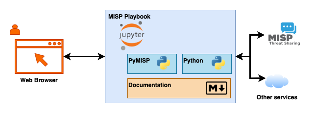

- [MISP playbooks - technical documentation](#misp-playbooks---technical-documentation)
- [Technical components](#technical-components)
- [Installation](#installation)
  - [Prerequisites](#prerequisites)
  - [Network location](#network-location)
  - [Prepare the environment](#prepare-the-environment)
    - [User account](#user-account)
    - [Clone the repository](#clone-the-repository)
    - [Virtual environment](#virtual-environment)
    - [Install Python libraries](#install-python-libraries)
  - [Setup](#setup)
    - [Basic Jupyter configuration](#basic-jupyter-configuration)
    - [SSL](#ssl)
    - [Password protect notebooks](#password-protect-notebooks)
    - [Configuration check](#configuration-check)
  - [Systemd startup script](#systemd-startup-script)
  - [Browser access](#browser-access)
- [MISP](#misp)
  - [Authentication key](#authentication-key)
- [MISP playbooks from the GitHub repository](#misp-playbooks-from-the-github-repository)
  - [Copy the MISP playbooks](#copy-the-misp-playbooks)
  - [Install the libraries for MISP playbooks](#install-the-libraries-for-misp-playbooks)
  - [Directory layout](#directory-layout)
- [Resources](#resources)

# MISP playbooks - technical documentation

# Technical components

MISP playbooks rely on two components :

- **PyMISP**, a Python library to access MISP via the REST API;
- **Jupyter notebooks**, that contain the playbook with documentation and code.

In addition, the playbooks are controlled via a **web browser**.



The Jupyter notebooks exist in different flavours. Where [Jupyter Notebook](https://jupyter.org/install) and [JupyterLab](https://jupyter.org/install) are primarily designed for **single-user** use, [JupyterHub](https://jupyter.org/hub) is designed for **multi-user** use. 

| Type | Use | Details |
|------|-------|---------|
|Jupyter Notebook|Single user|Classic single notebook interface|
|JupyterLab|Single user|New multi notebook interface|
|JupyterHub|Multi user|Server version|

*MISP playbooks are developed in JupyterLab but should also be functional in Jupyter Notebook and JupyterHub.*

# Installation

There are different ways to install JupyterLab. If you have Docker you can start with one of the ready-to-run [Docker images](https://jupyter-docker-stacks.readthedocs.io/en/latest/using/selecting.html) maintained by the Jupyter Team. You can also install JupyterLab directly on Linux, OSX or Windows, as long as you have **Python version 3** installed.

*The remainder of this documentation assumes you use Linux (Ubuntu, but other versions should also work).*

## Prerequisites

You need
- A recent **Linux** system with **Python 3** and a working internet connection to install the libraries;
- Access to one or more **MISP servers** (network access, the URL and an API key);
- A system with more than 2GB of RAM available (varies depending on the size of your notebooks) and more than 1GB of free disk space to store your notebooks.

## Network location

Although you can make JupyterLab available to the public Internet, it is strongly recommended not to do this and run it on an **internal** network. With the code in the notebooks you're basically allowing "direct code" access, something you will most likely not want to grant to the entire Internet.

If you do want to grant access to a larger network, it is advised to setup an reverse  proxy in front of JupyterLab. You can then handle the authentication in that reverse proxy. An example NGINX configuration file is in [config/nginx-notebook.conf](../config/nginx-notebook.conf). In this example the NGINX server handles the SSL requests, does the forwarding to the HTTP server running on port 8899 and handles the authentication with Basic Authentication of users in `playbook.htpasswd`

## Prepare the environment

### User account

You can install JupyterLab under your Linux account or create a dedicated account. 

*The remainder of this documentation assumes MISP playbooks are installed under a **dedicated** user account `playbook`.*

Login to the Linux system, add the account, set a password and su to the new account.

```
sudo useradd -m -s /bin/bash playbook
sudo passwd playbook
su playbook
```

### Clone the repository

Then clone the MISP playbook repository from GitHub.

```
git clone https://github.com/MISP/misp-playbooks
cd misp-playbooks
```

### Virtual environment 

All the playbooks are executed from a **Python virtual environment**. This allows you to have multiple versions of Python libraries installed, independent of those already provided by your Linux system or other installed projects. In this case we create the virtual environment (called `playbooks`) and activate this environment. 

```
python3 -m venv playbooks
source playbooks/bin/activate
```

If have virtualenv installed, you can also use 

```
virtualenv -p /usr/bin/python3 playbooks
source playbooks/bin/activate
```

### Install Python libraries

Next install the Python libraries PyMISP and JupyterLab.

```
pip install pymisp jupyterlab notebook
```

## Setup

### Basic Jupyter configuration

The MISP playbook repository contains a basic Jupyter configuration file that you can use as a start to configure your environment. Create a configuration directory, copy the configuration file [config/misp-playbook-jupyter.py](../config/misp-playbook-jupyter.py) and create a directory for your notebooks.

```
mkdir playbooks/config
cp config/misp-playbook-jupyter.py playbooks/config/misp-playbook-jupyter.py
mkdir playbooks/my-playbooks
```

### SSL

It is a good idea to use SSL to encrypt the communication between your client (web browser) and JupyterLab. Create a self-signed certificate or use a valid certificate from services such as [Let’s Encrypt](https://letsencrypt.org/).

```
openssl req -x509 -nodes -days 3650 -newkey rsa:2048 -keyout playbooks/config/playbook-ssl.key -out playbooks/config/playbook-ssl.pem
```

In case you created a self-signed certificate, it's advised to provide your system FQDN (for example `notebook.misp.local`) as the 'Common Name'.

### Password protect notebooks

Protect the access to your notebooks with a password. The MISP playbook repository contains a helper script that asks for a password and stores the hash in a configuration file with the variable `ServerApp.password`. Start the script [tools/misp-playbook-jupyter.py](../tools/misp-playbook-jupyter.py) from the Python virtual environment and provide it the earlier created configuration file.

```
python tools/set_notebook_password.py playbooks/config/misp-playbook-jupyter.py
```

### Configuration check

Review the configuration file `playbooks/config/misp-playbook-jupyter.py` . Pay attention to the path used for **root_dir**, **certfile** and **keyfile**. 

```
c.ServerApp.root_dir = "/home/playbook/misp-playbooks/playbooks/my-playbooks/"
c.ServerApp.certfile = "/home/playbook/misp-playbooks/playbooks/config/playbook-ssl.pem"
c.ServerApp.keyfile = "/home/playbook/misp-playbooks/playbooks/config/playbook-ssl.key"
```

## Systemd startup script

As a last step, copy the sample **systemd** script. Do this as a user with sudo permissions (in a default setup, the `playbook` user does not have sudo permissions). Review the configuration of the systemd script, especially the values for **User** and **Group** and the paths in **ExecStart**. If everything looks good you can enable and start the daemon.

```
sudo cp config/misp-playbook-jupyter.service /etc/systemd/system
cat /etc/systemd/system/misp-playbook-jupyter.service

sudo systemctl daemon-reload
sudo systemctl enable misp-playbook-jupyter.service
sudo systemctl start misp-playbook-jupyter.service
```

Verify in the logs that the service started without problems.

```
journalctl -u misp-playbook-jupyter
```

You should then get a message similar to the one below.

```
... ServerApp] jupyterlab | extension was successfully loaded.
... ServerApp] nbclassic | extension was successfully loaded.
```

## Browser access

Now open your browser and navigate to the IP or domain that points to your system. Do not forget to add **https** and the port number (by default **8899**). If all went well you get a web page asking you to enter the password you provided earlier.


When you enter the password you should be greeted with the JupyterLab web interface.


# MISP 

## Authentication key

The playbooks require a MISP API key and they will typically load the credential information from a `keys.py` file stored in the `vault` directory. First create the vault directory in your Python virtual environment (most likely `playbook`) and add a keys.py file.

```
mkdir playbooks/vault
```

Contents of `keys.py`
```
misp_url="https://misp/"
misp_key="APIKEY"
misp_verifycert=False
```

You can create a new MISP API key via the MISP web interface by navigating to **Global Actions**, **My Profile** and then choosing **Authentication key**. Provide a meaningful comment when you create the new API key. Then 

- Add this key to keys.py (in `misp_key`)
- Update the MISP URL (in `misp_url`)

# MISP playbooks from the GitHub repository

## Copy the MISP playbooks

The MISP playbooks included in this repository are in the folder `misp-playbooks`. Copy these playbooks into your working directory.

Either you can choose to copy them in a separate directory in your playbooks directory, or copy them directly into your playbooks directory.

To copy them directly into your playbooks directory : 

```
cp -rp misp-playbooks/* playbooks/my-playbooks/
mkdir playbooks/my-playbooks/helpers
cp -rp misp-playbooks/helpers/* playbooks/my-playbooks/helpers/
```

To copy them into a separate directory `misp-playbooks` :
```
cp -rp misp-playbooks playbooks/my-playbooks/
```
If you copied them into a separate directory then update the reference to the vault in the MISP playbooks. Instead of `sys.path.insert(0, "../vault/")`, you will have to use `../../vault/`.

## Install the libraries for MISP playbooks

Some MISP playbooks require additional Python libraries. You can install them with pip.

```
pip install -r documentation/requirements.txt
```

## Directory layout

```
misp-playbooks:     GitHub repository
\
| misp-playbooks:   MISP playbooks in this repository
  \ 
  | helpers:       Helper files for the playbook (such as images)
| config:           Default configuration files
| documentation:    Documentation
| tools:            Support tools
| playbooks:        YOUR playbooks environment
  \ 
  | venv:           Python virtual environment
  | vault:          Vault with keys file
  | config:         Local configuration file
  | my-playbooks:   YOUR playbooks
    \
    | helpers:       Helper files for the playbook (such as images)
```    

# Resources

- https://jupyterlab.readthedocs.io/en/stable/
- https://jupyter.org/install

