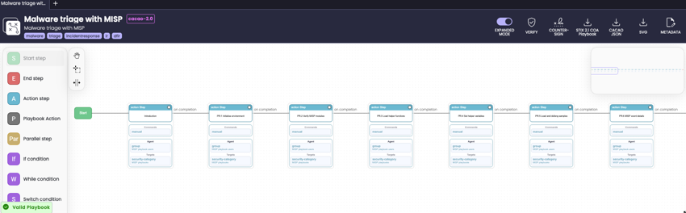
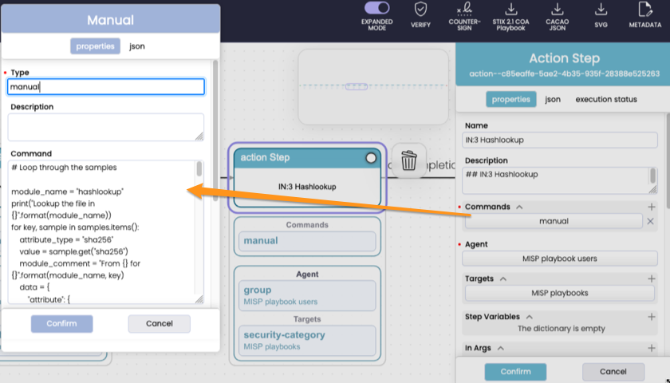
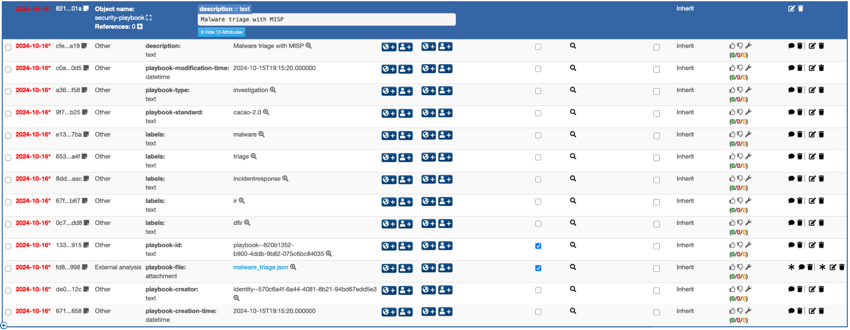

# Conversion between MISP Playbooks and CACAO Security Playbooks

## CACAO Security Playbooks

A CACAO security playbook is a standardised framework to document the procedures to handle security incidents. It consists of a series of steps organised into a workflow, outlining the actions for the detection, investigation, prevention, mitigation, and remediation of an incident. The [CACAO Security Playbooks Version 2.0](https://docs.oasis-open.org/cacao/security-playbooks/v2.0/cs01/security-playbooks-v2.0-cs01.html) specifications, published by OASIS, provide a comprehensive guide on how these playbooks can be created, documented, and shared in a structured and consistent manner across organisational boundaries and technological platforms.

An important aspect is that CACAO security playbooks are in **JSON**, which makes it only natural to have some form of conversion between MISP playbooks and CACAO security playbooks.There are two tools for this conversion:

- `misp_playbook_to_cacao_playbook.py`: Converts a MISP playbook to a CACAO security playbook
- `cacao_playbook_to_misp_playbook.py`: Converts a CACAO security playbook to a MISP playbook

It is recommended to run these tools within a **Python virtual environment**, such as the *venv* used to run the MISP playbooks.

## Convert a MISP Playbook to a CACAO Security Playbook

The script `misp_playbook_to_cacao_playbook.py`, located in the [tools directory](../tools/misp_playbook_to_cacao_playbook.py), converts a MISP playbook to a CACAO security playbook and requires two arguments:

- The **input** MISP playbook, and
- The **output** CACAO security playbook.

After the conversion, it verifies that the output complies with the [CACAO JSON schema](https://github.com/oasis-open/cacao-json-schemas). For example, the command below converts the MISP playbook for malware triage into a CACAO security playbook.

```
python misp_playbook_to_cacao_playbook.py misp-playbooks/misp-playbooks/pb_malware_triage.html cacao_malware_triage.json
```

The conversion takes about 5 to 10 seconds and the result is a JSON file, which can be used in the tools designed to manage CACAO playbooks, such as [CACAO Roaster](https://github.com/opencybersecurityalliance/cacao-roaster).





There are some important aspects of the conversion to be aware of:

- The playbook operates on a **linear** flow, lacking support for conditional if/else constructs. These scripts represent the initial phase of converting your MISP playbooks to CACAO security playbooks. You will need to subsequently invest effort into integrating additional **logic** and flow control mechanisms to complete the adaptation.
- It will ignore the sections '# Playbook', '## Technical details', and '## External references' (defined in `skip_headings`).
- The Markdown cells are merged together as the **description** of the workflow steps, and code cells are added as **manual commands** within each workflow step.
- MISP playbook tags (from the introductory section) are transformed into **CACAO labels**.
- The CACAO playbook type is set to **investigation** (defined in `playbook["playbook_types"]`).
- CACAO activities are derived from the MISP playbook headers.

A sample converted MISP playbook is in [sample_misp_playbook_to_cacao_malware_triage.json](sample_misp_playbook_to_cacao_malware_triage.json).

## Convert a CACAO Security Playbook to a MISP Playbook

The script `cacao_playbook_to_misp_playbook.py`, also located in the [tools directory](../tools/cacao_playbook_to_misp_playbook.py), converts a CACAO security playbook into a MISP playbook and also requires two arguments:

- The **input** CACAO security playbook, and
- The **output** MISP playbook.

```
python cacao_playbook_to_misp_playbook.py malware_triage.json misp-playbooks/custom/malware_triage.html
```

The result is a Jupyter notebook file (`.html`) that can be used as a starting point to build your MISP playbook. Note that this conversion does not include the MISP introductory section (setting up MISP connectivity, loading modules, etc.) and assumes that the CACAO playbook is **linear**.

# MISP Objects

These conversion tools between MISP playbooks and CACAO security playbooks are not the only means available to integrate MISP with CACAO. As part of the MISP objects, there is also the [security-playbook](https://www.misp-project.org/objects.html#_security_playbook) MISP object.

This object allows you to **utilise MISP as a sharing platform for security playbooks**. In addition to sharing threat events, including indicators and the contextual elements associated with activities, you can also share security playbooks with your peers. Moreover, these security playbooks (regular MISP objects) adhere to the same sharing designations, meaning you can share playbooks with a broader audience or include more specific and detailed playbooks with organisations that are part of your community.

